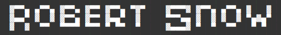

### Hi there 👋 Welcome to my GitHub Portfolio.
You can reach me at robjsnow@gmail.com if you're interested in collaboration or have other inquiries.  :briefcase:


<!--START_SECTION:waka-->
📊 **This Week I Spent My Time On** 

```text
💬 Programming Languages: 
TypeScript               4 hrs 47 mins       ███████████░░░░░░░░░░░░░░   43.55 % 
Prisma                   2 hrs 58 mins       ███████░░░░░░░░░░░░░░░░░░   27.04 % 
HTML                     1 hr 9 mins         ███░░░░░░░░░░░░░░░░░░░░░░   10.45 % 
Bash                     1 hr 5 mins         ██░░░░░░░░░░░░░░░░░░░░░░░   09.98 % 
Markdown                 34 mins             █░░░░░░░░░░░░░░░░░░░░░░░░   05.26 % 

🔥 Editors: 
VS Code                  11 hrs              █████████████████████████   100.00 % 

🐱‍💻 Projects: 
NINJA                    9 hrs 36 mins       ██████████████████████░░░   87.27 % 
LC                       1 hr 4 mins         ██░░░░░░░░░░░░░░░░░░░░░░░   09.77 % 
yf-client-sites          19 mins             █░░░░░░░░░░░░░░░░░░░░░░░░   02.96 % 

💻 Operating System: 
Windows                  11 hrs              █████████████████████████   100.00 % 
```


 Last Updated on 15/08/2025 18:49:39 UTC
<!--END_SECTION:waka-->

<!--
**robjsnow/robjsnow** is a ✨ _special_ ✨ repository because its `README.md` (this file) appears on your GitHub profile.

Here are some ideas to get you started:

- 🔭 I’m currently working on ...
- 🌱 I’m currently learning ...
- 👯 I’m looking to collaborate on ...
- 🤔 I’m looking for help with ...
- 💬 Ask me about ...
- 📫 How to reach me: ...
- 😄 Pronouns: ...
- ⚡ Fun fact: ...
-->

